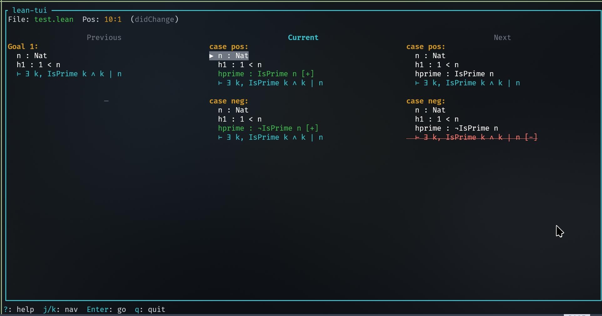

# Lean-TUI

This is a terminal-only info view, comparable to the VS Code info view for Lean 4. I developed this because not everyone wants to be stuck in the Microsoft ecosystem and use their own favorite text editor. Every editor with an LSP client can be used in combination with this.



Interactive:

- Use `j`, `k` to go up or down in hypotheses
- Click or press enter on hypotheses to jump to type definition in the editor
- Click on goals to go the goal in the editor
- Filter displayed assumptions (see help menu `?`)

Grid display:

- Display multiple goals below each-other as rows in a grid
- Toggle display previous and next proof state as columns in grid with `p` and `n` (also works in term-mode)

Close with `q`

## Installation

Install a terminal multiplexer like Zellij or Tmux so you can put the TUI info view next to your editor and see updates.

If you have never used Lean before, install `elan`, the Lean compiler toolchain manager. Run at least a `lake build` or `lake run`in your Lean test project to make sure your Lean code has its dependencies fetched (otherwise the LSP will not work)

Install Rust (sorry):

```bash
cargo install --git https://codeberg.org/wvhulle/lean-tui
```

Make sure `~/.cargo/bin` is in your path.

## Configuration

Use your favorite (modal) editor that has a built-in LSP client (I recommend Helix, but Neovim, Zed, Kate also seem to have one).

Go into the settings of your editor and configure the LSP command for lean to be `cargo run -- serve`. This will spawn a proxy LSP that intercepts communication with the Lake LSP every time you open a Lean file. Make sure to disable any other Lean LSP as this one will replace it and extend it.

## Usage

Open a terminal multiplexer like Zellij (I use this one) or Tmux.

Open your Lean file in your chosen editor.

Split terminal (in Zellij it is `CTRL+P, R`).

Launch the TUI in same directory with `lean-tui tui`. (Might take a long time first time because the Tree-Sitter parser is compiled)

Enter "insert mode" in a proof and start typing. (Note that the goals in the TUI update but only if you actually perform edits in insert mode or use the hover action)

## Debugging

Follow logs with:

```bash
tail -f /tmp/lean-tui.log
```
