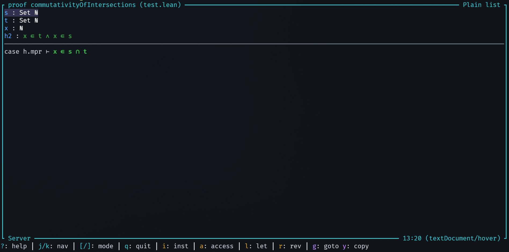
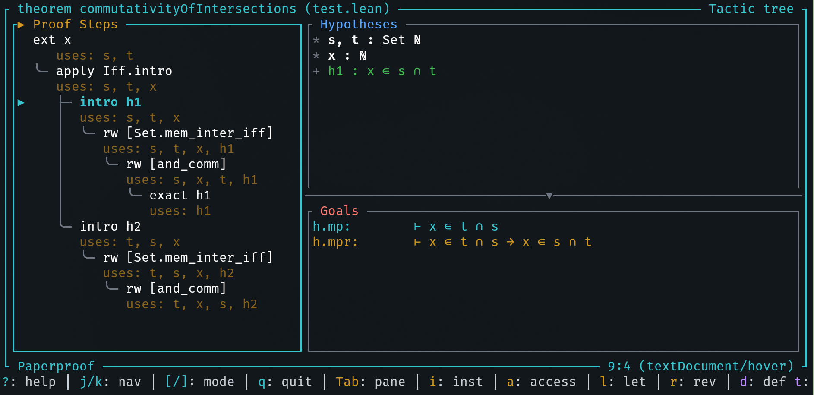
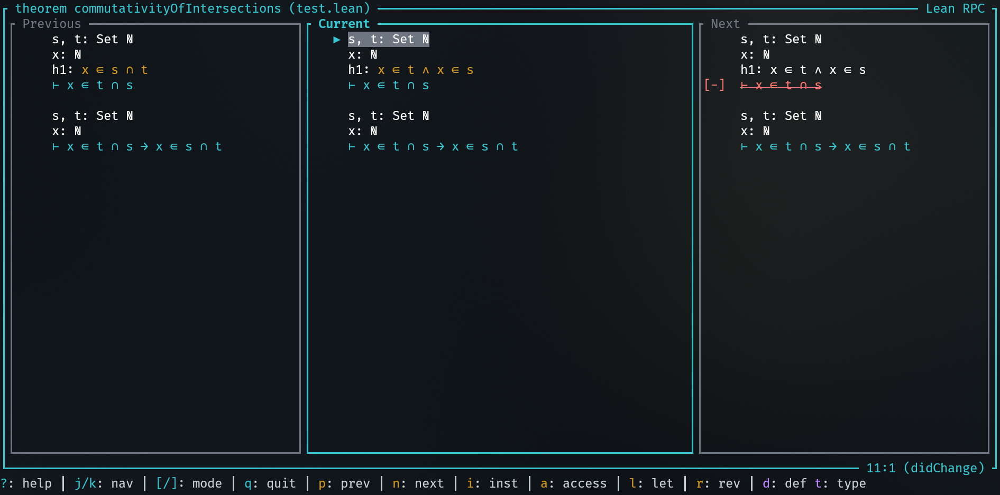
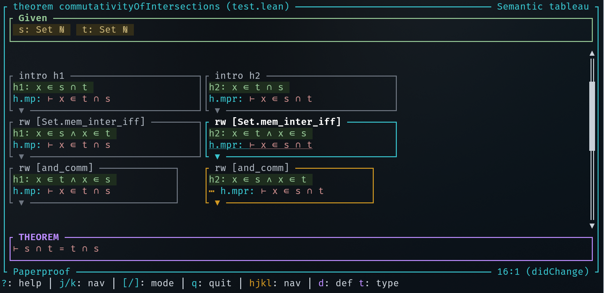
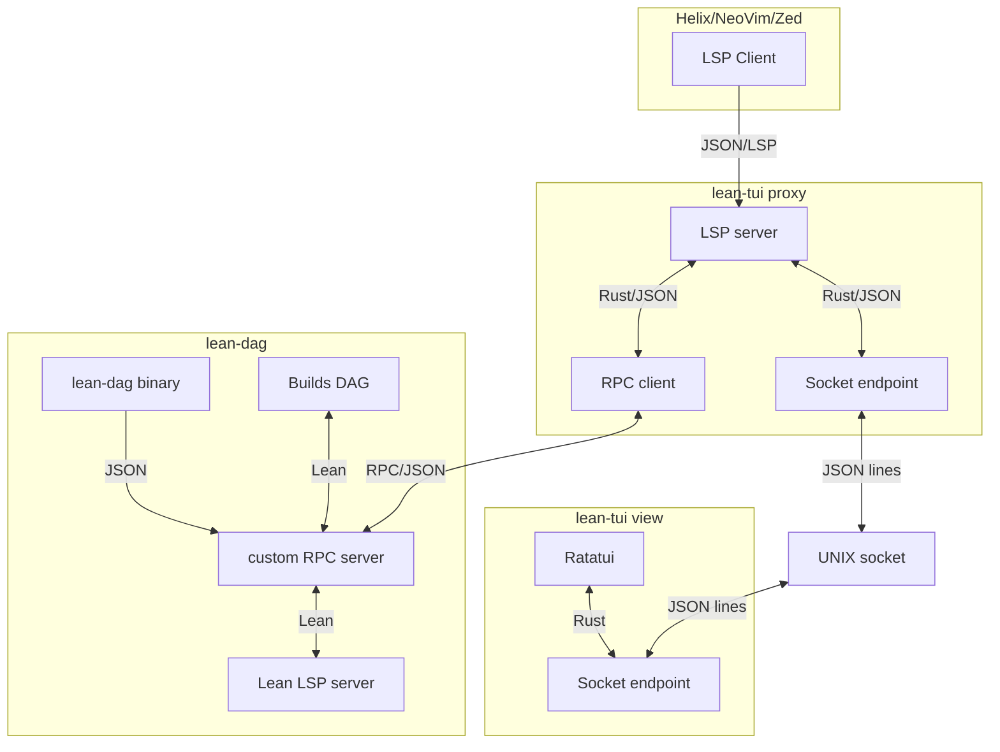

# Lean-TUI

**Standalone interactive view that shows a graph view of proofs that are written the Lean 4 theorem prover.**

Shows proof structure, hypotheses and goals (comparable to the VS Code Web-based infoview but in your terminal). However, this infoview can also show the **complete graph structure** of the complete proof, not only the current open goals. It also tracks your edits in editor and reversely you can use the infoview to jump to locations in the editor.

## Example

Below you can see (or go to [codeberg](https://codeberg.org/wvhulle/lean-tui)) a simple but incomplete Lean proof:

```lean
import Mathlib.Data.Set.Basic

theorem commutativityOfIntersections
    (s t : Set Nat) : s ∩ t = t ∩ s := by
  ext x
  apply Iff.intro

  intro h1
  rw [Set.mem_inter_iff, and_comm] at h1
  exact h1

  intro h2
  rw [Set.mem_inter_iff, and_comm] at h2

  -- exact h2
```

This program will visualize the (incomplete) proof state by querying the Lean run-time and displaying with one of the following styles:

| Linear                       | Graph                            |
| ---------------------------- | -------------------------------- |
|     |       |
|  |  |

Linear modes do not show much proof structure:

- Plain list: simplest display mode with just a list of open goals
- Before after: current active goal state and previous and next goal state

If you are interested in your proof as it evolves (like a directed acyclic graph), use one of these:

- Tactic tree: tree of the tactic structure next to active hypotheses and goals
- Semantic tableau: proof shown as a semantic tableau

## Installation

### 1. Compiler toolchains

If you have never used Lean before, install `elan`, the Lean compiler toolchain manager. Run at least a `lake build` or `lake run`in your Lean test project to make sure your Lean code has its dependencies fetched (otherwise the LSP will not work)

Install Rust (through [`rustup`](https://rustup.rs/)) if you haven't compiled Rust programs before.

### 2. Install this TUI

Then install this crate as a binary in your user with:

```bash
cargo install lean-tui
```

If `~/.cargo/bin` is in your path, you can now run this program with `lean-tui`.

### 3. Add `LeanDag` dependency

Add [LeanDag](https://github.com/wvhulle/lean-dag) as a Lake dependency.

In your `lakefile.toml`:

```toml
[[require]]
name = "LeanDag"
git = "https://github.com/wvhulle/lean-dag.git"
rev = "main"
```

Fetch the source code of the latest version (Lean only hosts on Git, does not provide prebuilt dependencies):

```bash
lake update LeanDag
```

Two modes:

- **Standard mode** (default): Uses `lake serve` and requires `import LeanDag` in your Lean files
- **Standalone mode** (`--standalone`): Uses the `lean-dag` binary directly, no imports needed

The standalone mode requires running `lean build LeanDag/lean-build` and adding `--standalone` to the proxy LSP server command in your editor.

## Configuration

Go into the settings of your editor and configure the LSP command for lean to be `lean-tui proxy`.

For example, for Helix, it would look like this:

```toml
# .helix/languages.toml
[language-server.lean-tui]
args = [
  "proxy",
] # Add `--standalone` argument if you want to use LeanDag through its binary `lean-dag`
command = "lean-tui"

[[language]]
language-servers = ["lean-tui"]
name = "lean"
```

Make sure to disable any other Lean LSP as this one will replace it and extend it.

## Usage

### 1. Split your terminal

You can choose between:

- Using multiple terminals (emulator windows) side-by-side (a terminal app is typically provided on every OS)
- Using a single terminal window with a terminal multiplexer (you'll need to install `zellij` or `tmux` with your system package manager)

Open your Lean file in your favorite (modal) editor that has a built-in LSP client (I recommend Helix, but Neovim, Zed, Kate also seem to have one).

Split terminal. Launch the TUI in same directory in the second terminal with `lean-tui view`.

### 2. Start writing proofs

Switch back to your editor:

1. Move your cursor somewhere in a proof or function
2. Type in a proof or hover over tactics (`space,k` in Helix)

### 3. Play with Lean-TUI

Switch to the TUI. Key bindings:

| Key   | Action                          |
| ----- | ------------------------------- |
| `↑/↓` | Navigate hypotheses and goals   |
| `g`   | Go to where item was introduced |
| `y`   | Copy to clipboard (OSC 52)      |
| `[/]` | Switch display mode             |
| `?`   | Help menu                       |
| `q`   | Quit                            |

The TUI follows your cursor in the editor automatically.

## How does it work?

This is mainly a front for **lean-dag**, a custom LSP server that adds an RPC method on top of the built-in LSP-compliant RPC methods provided by Lean's LSP. The additional RPC methods uses Lean's internal APIs to extract detailed proof information (tactic applications, goal transformations, goto locations) that isn't available through standard LSP.

The name `lean-dag` comes from Lean [Directed Acyclic Graph (DAG)](https://en.wikipedia.org/wiki/Directed_acyclic_graph) since its main goal is showing your proof state as a graph. Lean TUI is just a front-end that connects to a proxy LSP (also defined in `lean-dag` that intercepts the standard LSP and adds DAG extraction.



## Debugging

If you see errors in the editor like "incompatible headers", you can try

1. Close both the TUI view and the LSP client and restart.
2. Rebuilding `lean-dag`

If that does not help and you have time, follow along with the logs while reproducing the bug (and paste the output in a bug report):

```bash
tail -f ~/.cache/lean-tui/proxy.log # Proxy server only (for debugging RPC deserialization)
tail -f ~/.cache/lean-tui/tui.log # TUI front-end only (for debugging the Ratatui-side)
tail -f ~/.cache/lean-tui/lean-dag.log # Lean RPC server (for debugging Lean-side)
```

Some editors also have debug logs for the LSP client. For Helix:

```bash
tail -f ~/.cache/helix/helix.log
```

## Why?

For the **VS Code users**: I don't like VS Code and vendor lock-in, but I like the LSP protocol. The LSP protocol allows programmers to pick whichever editor they like. This means programmers (and mathematicians) will never be stuck with any big company.

For **[Paperproof](https://github.com/Paper-Proof/paperproof) users**: Paperproof was a big inspiration for this. However, it is Web-based. I used their approach to move most of the logic into Lean and add an RPC method there.

For the **NVIM users**, yes there existed an info view [Lean plugin for Neovim](https://github.com/Julian/lean.nvim) already, but not yet for the other terminal editors (Zed, Kakoune, Helix, ..) since the Lean plugin relies on NeoVim specific features. It is not a generic one.

The `lean-dag` LSP server and this front-end is my attempt at a more generic one, not bound to any editor in particular, and usable from any terminal window.

Let me know if you tried it out and encountered any issues! PRs are also welcome.
