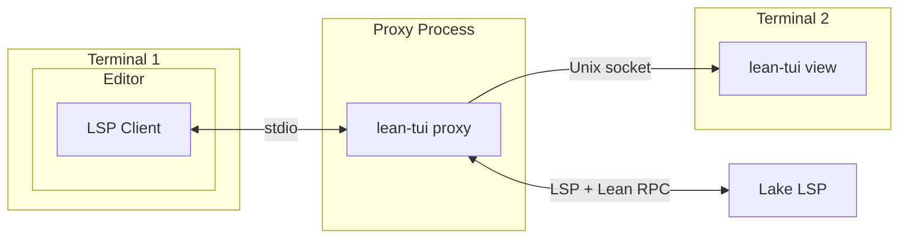
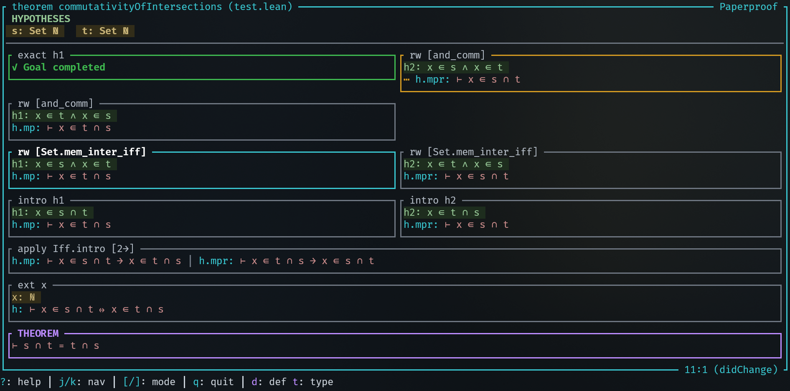
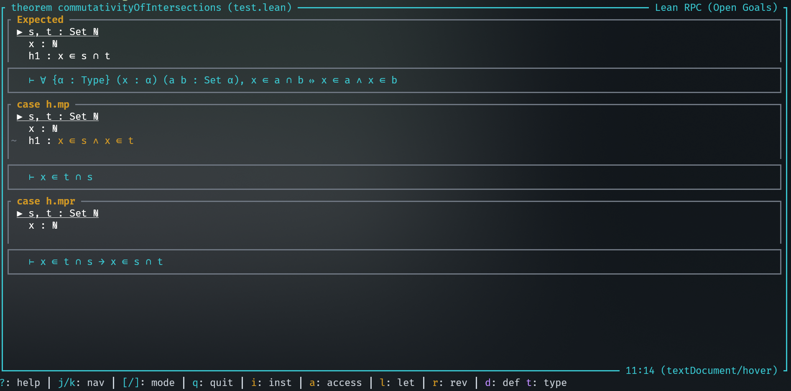
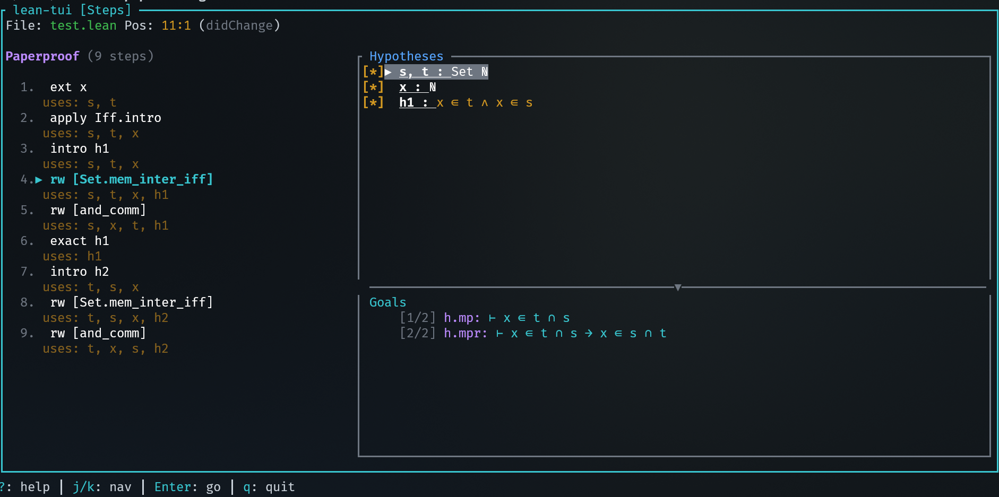

# Lean-TUI

(**Warning**: early release, under development)

This is a **terminal-only info view**, comparable to the VS Code info view for [Lean 4](https://lean-lang.org/).

It shows:

- The active variable bindings for a developer writing code (term mode).
- The hypotheses and goals for a mathematician proving and formalizing proofs (tactic mode).

## How does it work?

This program will spawn a proxy LSP that intercepts communication with the Lake LSP every time you open a Lean file.



Start typing a proof in your editor and you will see the proof state appear in the terminal.

Key bindings:

- Use `j`, `k` to go up or down in hypotheses
- Click or press enter on hypotheses to jump to type definition in the editor
- Click on goals to go the goal in the editor
- Help menu `?`
- Close with `q`
- Switch proof display styles: `[`, `]` (installation PaperProof is be required for some)

| Vanilla                      | PaperProof                            |
| ---------------------------- | ------------------------------------- |
|  |        |
|     |  |

## Installation

If you have never used Lean before, install `elan`, the Lean compiler toolchain manager. Run at least a `lake build` or `lake run`in your Lean test project to make sure your Lean code has its dependencies fetched (otherwise the LSP will not work)

Install Rust (through [`rustup`](https://rustup.rs/)) if you haven't compiled Rust programs before.

Then install this crate as a binary in your user with:

```bash
cargo install lean-tui
```

If `~/.cargo/bin` is in your path, you can now run this program with `lean-tui`.

Install [PaperProof](https://github.com/Paper-Proof/paperproof/tree/main) if you want to use deduction-style display mode.

## Configuration

Go into the settings of your editor and configure the LSP command for lean to be `lean-tui proxy`.

For example, for Helix, it would look like this:

```toml
# .helix/languages.toml
[language-server.lean-tui]
args = ["proxy"]
command = "lean-tui"

[[language]]
language-servers = ["lean-tui"]
name = "lean"
```

Make sure to disable any other Lean LSP as this one will replace it and extend it.

## Usage

You can choose between:

- Using multiple terminals (emulator windows) side-by-side (a terminal app is typically provided on every OS)
- Using a single terminal window with a terminal multiplexer (you'll need to install `zellij` or `tmux` with your system package manager)

Open your Lean file in your favorite (modal) editor that has a built-in LSP client (I recommend Helix, but Neovim, Zed, Kate also seem to have one).

Split terminal. Launch the TUI in same directory in the second terminal with `lean-tui view`.

Switch back to your editor:

1. Move your cursor somewhere in a proof or function
2. Enter "insert mode" in a proof
3. Start typing.

(Note that the goals in the TUI update but only if you actually perform edits in insert mode or use the hover action)

## Debugging

Follow `lean-tui` logs with:

```bash
tail -f ~/.cache/lean-tui/proxy.log
```

Some editors also have debug logs for the LSP client. For Helix:

```bash
tail -f ~/.cache/helix/helix.log
```

## Why?

I developed this because not everyone wants to be stuck in the Microsoft ecosystem. Many people have an efficient workflow in their own (often modal) text editor. There existed a [Lean plugin for Neovim](https://github.com/Julian/lean.nvim) already, but not yet for the other ones. This is my attempt at a more generic one, not bound to any editor in particular, and usable from any terminal window.

Let me know if you tried it out and encountered any issues! PRs are also welcome.
