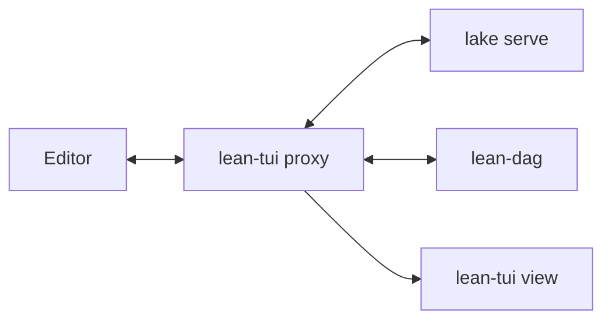

# Lean-TUI

(**Warning**: early release, under development)

This is a **terminal-only (TUI) info view**, comparable to the VS Code info view for [Lean 4](https://lean-lang.org/).

It shows:

- The proof structure, hypotheses and goals for a mathematician proving and formalizing proofs (tactic mode in Lean).
- The active variable bindings for a developer writing code (called "term-mode" in Lean).

See below (or go to [codeberg](https://codeberg.org/wvhulle/lean-tui)) for a screenshot of proof state of a simple but incomplete Lean proof:

```lean
import Mathlib.Data.Set.Basic

theorem commutativityOfIntersections
    (s t : Set Nat) : s ∩ t = t ∩ s := by
  ext x
  apply Iff.intro

  intro h1
  rw [Set.mem_inter_iff, and_comm] at h1
  exact h1

  intro h2
  rw [Set.mem_inter_iff, and_comm] at h2

  -- exact h2
```

Screenshots of different display modes

| Linear                       | Graph                            |
| ---------------------------- | -------------------------------- |
|     |       |
|  |  |

There are different display modes. Linear modes do not show much proof structure:

- Plain list: simplest display mode with just a list of open goals
- Before after: current active goal state and previous and next goal state

There are two additional modes that show more graph structure:

- Tactic tree: tree of the tactic structure next to active hypotheses and goals
- Semantic tableau: proof shown as a semantic tableau

Switch proof display styles: `[`, `]`

## Installation

### 1. Compiler toolchains

If you have never used Lean before, install `elan`, the Lean compiler toolchain manager. Run at least a `lake build` or `lake run`in your Lean test project to make sure your Lean code has its dependencies fetched (otherwise the LSP will not work)

Install Rust (through [`rustup`](https://rustup.rs/)) if you haven't compiled Rust programs before.

### 2. Install this TUI

Then install this crate as a binary in your user with:

```bash
cargo install lean-tui
```

If `~/.cargo/bin` is in your path, you can now run this program with `lean-tui`.

### 3. Add `LeanDag` dependency

Add [LeanDag](https://github.com/wvhulle/lean-dag) as a Lake dependency.

In your `lakefile.toml`:

```toml
[[require]]
name = "LeanDag"
git = "https://github.com/wvhulle/lean-dag.git"
rev = "main"
```

### 4. Build `lean-dag`

Fetch the source code of the latest version (Lean only hosts on Git, does not provide prebuilt dependencies):

```bash
lake update LeanDag
```

Build the `lean-dag` binary (it will stay deep in the build artifacts directory):

```bash
lake build LeanDag/lean-dag
```

## Configuration

Go into the settings of your editor and configure the LSP command for lean to be `lean-tui proxy`.

For example, for Helix, it would look like this:

```toml
# .helix/languages.toml
[language-server.lean-tui]
args = ["proxy"]
command = "lean-tui"

[[language]]
language-servers = ["lean-tui"]
name = "lean"
```

Make sure to disable any other Lean LSP as this one will replace it and extend it.

## Usage

### 1. Split your terminal

You can choose between:

- Using multiple terminals (emulator windows) side-by-side (a terminal app is typically provided on every OS)
- Using a single terminal window with a terminal multiplexer (you'll need to install `zellij` or `tmux` with your system package manager)

Open your Lean file in your favorite (modal) editor that has a built-in LSP client (I recommend Helix, but Neovim, Zed, Kate also seem to have one).

Split terminal. Launch the TUI in same directory in the second terminal with `lean-tui view`.

### 2. Start writing proofs

Switch back to your editor:

1. Move your cursor somewhere in a proof or function
2. Enter "insert mode" in a proof
3. Start typing or hover

### 3. Play with Lean-TUI

Switch to the TUI. Key bindings:

- Use the arrows or click on hypotheses and goals
- Use `d` to jump to definition (first resolvable constant in the type)
- Use `t` to jump to the type of the first variable
- Use `y` to copy selected hypothesis or goal to clipboard (OSC 52)

Examples for a goal `s ∩ t = t ∩ s` where `s t : Set Nat`:

| Key | Target | Why |
|-----|--------|-----|
| `d` | `Inter.inter` | First operation that has source code (skips `Eq` from Prelude) |
| `t` | `Set` | Type of the first variable `s` |

For a hypothesis `h : x ∈ s`:

| Key | Target | Why |
|-----|--------|-----|
| `d` | `Set.Mem` | The membership operation |
| `t` | `Nat` | Type of `x` (assuming `x : Nat`) |

Proof states that are incomplete will be yellow and the ones you are currently working on blue.
Normally, you **should not need to switch** often from now on, as the Lean-TUI window will follow your edits/hovers in the editor by default.

_Under development: filtering certain types of hypotheses with keyboard shortcuts (`i` for class instance terms and so on)._

More shortcuts:

- Help menu `?`
- Close with `q`

## Why?

I developed this because not everyone wants to be stuck in the Microsoft ecosystem. Many people have an efficient workflow in their own (often modal) text editor. There existed a [Lean plugin for Neovim](https://github.com/Julian/lean.nvim) already, but not yet for the other ones. This is my attempt at a more generic one, not bound to any editor in particular, and usable from any terminal window.

Let me know if you tried it out and encountered any issues! PRs are also welcome.

## How does it work?

This program spawns a proxy LSP that intercepts communication between your editor and Lean's build system.



**Data flow:**

1. **Editor → Proxy**: Your editor sends LSP requests (hover, completion, diagnostics) to the proxy
2. **Proxy → Lake LSP**: Standard requests are forwarded to `lake serve` for normal Lean functionality
3. **Proxy → lean-dag**: When cursor moves into a proof, the proxy asks lean-dag for the `ProofDag` structure
4. **Proxy → TUI**: Goal state and proof structure are pushed to the TUI via Unix socket

**lean-dag** is a custom LSP server that runs alongside Lake. It uses Lean's internal APIs to extract detailed proof information (tactic applications, goal transformations, goto locations) that isn't available through standard LSP.

## Debugging

If you see errors in the editor like "incompatible headers", you can try

1. Close both the TUI view and the LSP client and restart.
2. Rebuilding `lean-dag`

If that does not help and you have time, follow along with the logs while reproducing the bug (and paste the output in a bug report):

```bash
tail -f ~/.cache/lean-tui/proxy.log # Proxy server only (for debugging RPC deserialization)
tail -f ~/.cache/lean-tui/tui.log # TUI front-end only (for debugging the Ratatui-side)
tail -f ~/.cache/lean-tui/lean-dag.log # Lean RPC server (for debugging Lean-side)
```

Some editors also have debug logs for the LSP client. For Helix:

```bash
tail -f ~/.cache/helix/helix.log
```
